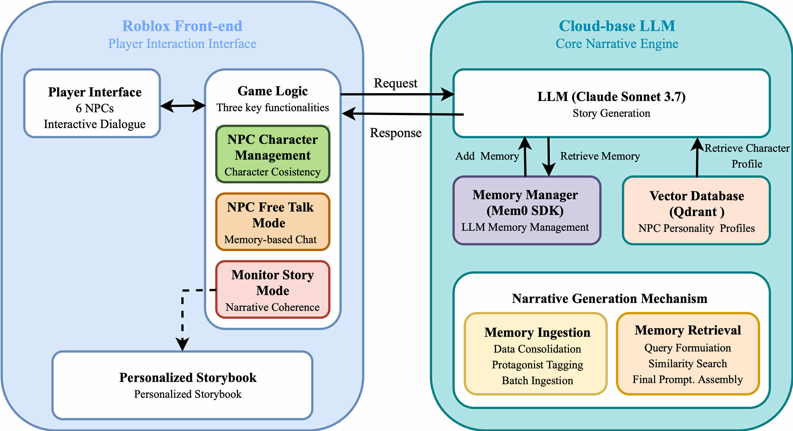

# Mystery Library: LLM Memory Management for Roblox-Based AI-Native Narrative Games

This repository contains the prototype implementation for **Mystery Library**, a Roblox Studio-based AI-native narrative adventure game developed for the paper:

**Memory Management of LLM-Driven Storytelling for AI-Native Narrative Games**

The project investigates how Large Language Models (LLMs) can support dynamic storytelling in games by combining structured short-term prompts with long-term memory management. The game itself was developed in **Roblox Studio**, while this repository mainly provides the backend memory and LLM interaction components used to support NPC dialogue, memory retrieval, and narrative continuity.

## Overview

Traditional game narratives usually rely on manually written dialogue, branching scripts, and predefined character arcs. This approach is difficult to scale in open-world or player-driven environments.

Mystery Library explores an alternative approach: an AI-native narrative game in which LLMs dynamically generate dialogue, story fragments, and NPC responses based on player interactions. To reduce forgetting, contradiction, and inconsistent NPC behavior, the system integrates short-term prompting with long-term memory management.

The prototype features a cursed library setting with multiple NPCs. Players interact with NPCs through missions, dialogue, and free-form conversations. Each interaction may contribute to the unfolding story and can be stored or retrieved through the memory system.

## Key Features

- Roblox Studio-based AI-native narrative game prototype
- LLM-driven NPC dialogue and storytelling
- Short-term memory through structured prompts
- Long-term memory management using mem0
- Vector-based retrieval for NPC personality and story continuity
- Backend server for communication between Roblox Studio and the LLM memory system
- Experimental design for evaluating narrative coherence, contradiction, entity continuity, emotional arcs, plot novelty, and diversity

## System Architecture

The system consists of two main parts:

1. **Game Server / Roblox Studio Side**
   - Handles player interaction inside the Roblox game
   - Manages NPC missions, dialogue triggers, and game flow
   - Sends player actions and dialogue context to the backend server

2. **LLM Server / Memory Backend**
   - Handles LLM-based narrative generation
   - Stores and retrieves memory using mem0
   - Uses vector retrieval to support NPC personality consistency and story continuity
   - Returns generated dialogue or story content to the Roblox game



## Paper

This repository accompanies the paper:

**Memory Management of LLM-Driven Storytelling for AI-Native Narrative Games**

Accepted by the TAAI International Track.

📄 [Read the paper](docs/TAAI2025_Paper.pdf)

## Demo Video

🎬 [Watch the demo video](https://www.youtube.com/watch?v=uZm0jRymoGM)

## Repository Structure

```text
.
├── server.py                  # Main backend server for LLM and memory interaction
├── uploadNPC.py               # Uploads or initializes NPC memory data
├── queryNPC.py                # Queries stored NPC memory
├── monitorMem.py              # Monitors memory records
├── deleteMem.py               # Deletes memory entries
├── npc_memory_dataset.json    # Example NPC memory dataset
├── instruction.md             # Prompt and system instruction design
├── requirements.txt           # Python dependencies
├── Dockerfile.server          # Docker configuration for the backend server
├── docker-compose.yml         # Docker Compose setup
├── docs/                      # Paper and supplementary materials
└── 流程圖.jpg                  # System architecture diagram
